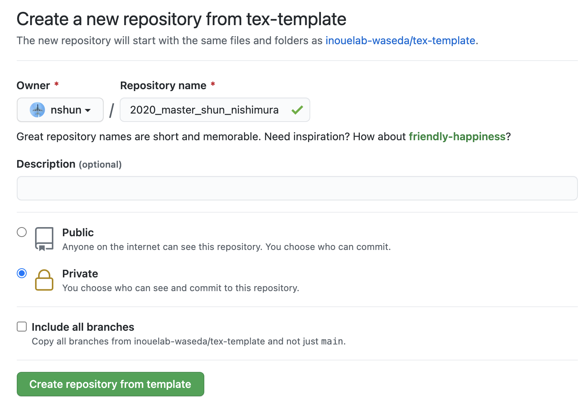
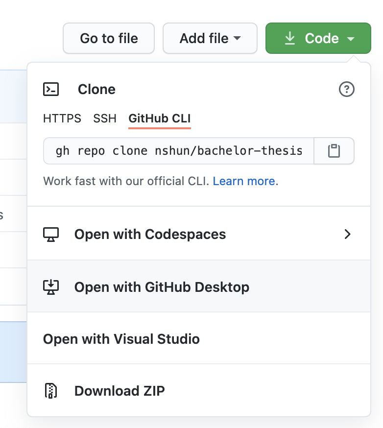
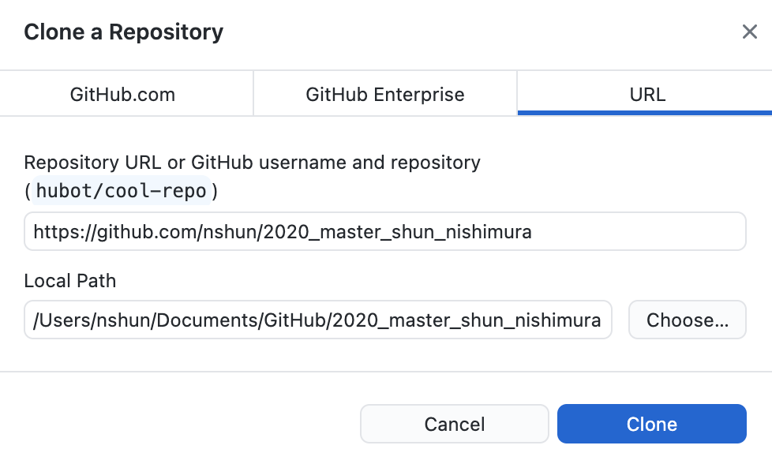
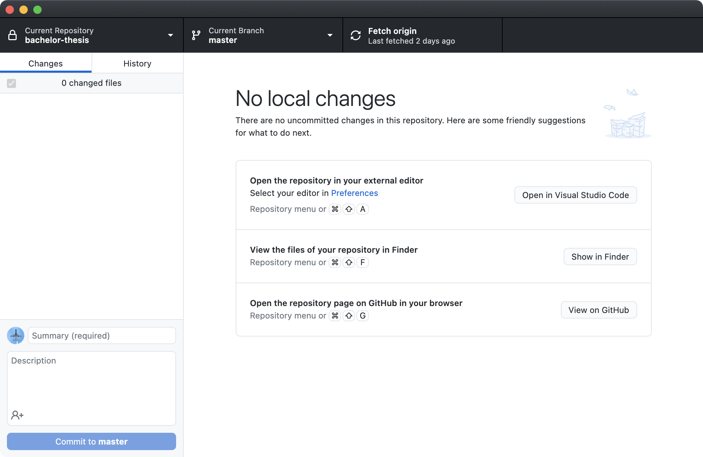
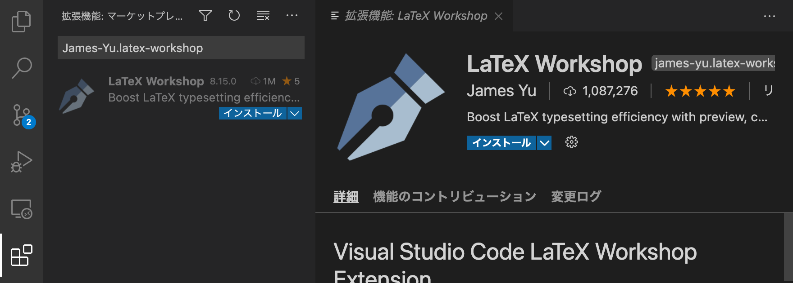
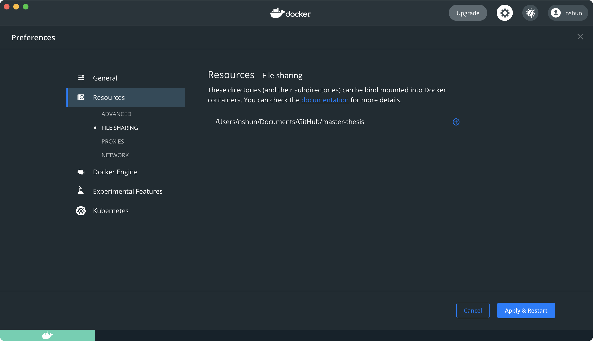

# tex-template

TeX を書くテンプレート

## 必要なもの

- Win/Mac の入った PC
- inouelab-waseda に参加している Github アカウント

## 準備

- すでに入ってるものは適宜読み飛ばす
- わからなかったら検索して、このファイルに追記する

### Github Desktop

以下のリンクからインストーラをダウンロードして指示に従う

https://desktop.github.com/

自分のアカウントでログインできたら次に進む

参照: https://docs.github.com/ja/desktop/installing-and-configuring-github-desktop

### 複製＆クローン

- このリポジトリを開く (https://github.com/inouelab-waseda/tex-template)
- 右上の `Use this template` を押す
- 画像のように変更
  - Owner を `自分`
  - Repository name を `2020_master_name` (修士) / `2020_bachelor_name` (学士)
  - `Private`



- `Create repository from template` を押す
- 作成が完了したらリポジトリのページになる
- 緑色の `Code` ボタンを押して出てくる `Open with Github Desktop` をクリック
  - （タブを閉じた場合は Github にログインした後の検索欄から探す）



- Github Desktop で以下の画面になるので、場所を指定して `Clone` ボタンを押す
-


- ダウンロードが終わるまで待つ
- 以下のような画面になったらOK



### VSCode

以下のリンクからインストーラをダウンロードして指示に従う

https://code.visualstudio.com/

### VSCode 拡張

- VSCode を開いて左側から拡張機能のボタンをクリック
- 検索欄に `James-Yu.latex-workshop` を入れて検索
- 拡張機能をインストール



### Docker Desktop

以下のリンクからインストーラをダウンロードして指示に従う

https://www.docker.com/get-started

### コンテナをプル

windows なら `powershell`、mac なら`Terminal.app`を開いて以下を実行

```
docker pull nshun/latex
```

### (Mac 向け) ファイル共有設定

- Docker Desktop を開いて、以下の設定に移動
- `Docker -> Preferences... -> Resources -> File Sharing.`
- リポジトリのパスを追加する



- 右下の `Apply & Restart` を押す

## 使い方

- Docker サービスを起動させておく
  - Docker Desktop を開いておけばOK
- VSCode でリポジトリを開く
  - Github Desktop で `Command(Ctrl)+ Shift + A`
- `.tex` ファイルを開く
- 右上の `▷` でビルド開始
- PDF が生成される
  - `▷` の右のボタンがプレビューボタン
